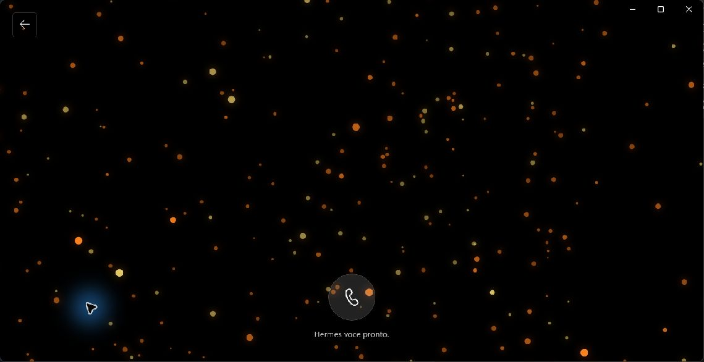
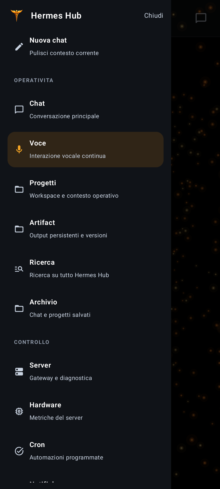
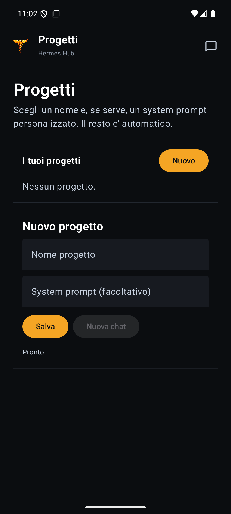
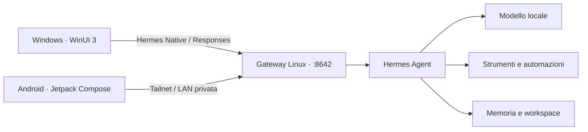

<p align="center">
  
</p>

<h1 align="center">Hermes Hub</h1>

<p align="center">
  <strong>Il centro di comando personale per Hermes Agent.</strong><br />
  Chat, voce, strumenti e controllo del tuo home server da Windows e Android.
</p>

<p align="center">
  <a href="https://github.com/JackoPeru/HermesHub/actions/workflows/quality.yml"></a>
  <a href="https://github.com/JackoPeru/HermesHub/releases/latest"></a>
  
  
  
</p>

<p align="center">
  <a href="https://github.com/JackoPeru/HermesHub/releases/latest"><strong>Scarica l'ultima release</strong></a>
  ·
  <a href="#panoramica">Panoramica</a>
  ·
  <a href="#come-funziona">Architettura</a>
  ·
  <a href="#sviluppo">Sviluppo</a>
</p>


## Panoramica

Hermes Hub porta **Hermes Agent** fuori dal terminale e lo rende un ambiente operativo quotidiano. Il server personale mantiene intelligenza, memoria, planning e strumenti; le app offrono un'interfaccia coerente per lavorare da PC o smartphone, senza introdurre un secondo backend.

| Chat agentica | Voce continua | Controllo operativo |
|---|---|---|
| Streaming live, reasoning separato, progressi reali e tool call leggibili. | VAD, Whisper STT e Kokoro TTS in una conversazione hands-free. | Stato gateway, hardware, cron, run, notifiche e servizi del server. |
| **Spazi di lavoro** | **Media e artifact** | **Continuità** |
| Progetti con contesto, istruzioni, memoria e conversazioni collegate. | Allegati, Visual Blocks, immagini, video e output persistenti versionati. | Archivio sincronizzato, ricerca globale e passaggio fluido tra dispositivi. |

## L'app

### Windows · WinUI 3

Interfaccia desktop densa ma pulita: chat, cron, notifiche, server, prestazioni, audit, ricerca, voce, video e artifact restano raggiungibili dalla stessa sidebar.

<p align="center">
  
</p>

<p align="center"><sub>Modalità Voce nella release Windows 0.6.162.</sub></p>

### Android · Jetpack Compose

La stessa esperienza in mobilità, con navigazione pensata per il touch, azioni rapide e modalità Voce immersiva.

<p align="center">
  
  
  
</p>

<p align="center"><sub>Navigazione globale, workspace Progetti e modalità Voce nella release Android 0.6.162.</sub></p>

## Come funziona



Hermes Hub è un **thin client**. Non sostituisce il loop agente e non duplica memoria o policy: coordina tutte le superfici attraverso il gateway Linux del server.

- protocollo preferito: `hermes-native` / Responses;
- modello operativo: `hermes-agent`;
- trasporto intenzionale su Tailnet o LAN privata;
- un solo gateway per chat, archivio, media, STT, TTS, jobs, run e stato Hub;
- aggiornamenti gateway transazionali con staging, health probe e rollback.

<details>
<summary><strong>Endpoint predefiniti</strong></summary>

Il client prova nell'ordine:

1. `http://hermes:8642/v1`
2. `http://100.94.223.14:8642/v1`
3. `http://hermes.local:8642/v1`

HTTP cleartext è una scelta intenzionale esclusivamente per reti private Tailnet/LAN. Le impostazioni salvate dall'utente hanno precedenza sui default.

</details>

## Installazione

> Hermes Hub presuppone un server personale con Hermes Agent raggiungibile dalla propria rete privata.

Scarica gli asset dalla pagina [Releases](https://github.com/JackoPeru/HermesHub/releases/latest):

| Piattaforma | Asset | Requisiti |
|---|---|---|
| Windows | `NemoclawChat.Windows_X.Y.Z.0_x64.msix` | Windows 10 build 17763 o successiva, x64 |
| Android | `HermesHub-X.Y.Z-android.apk` | Android 8.0 / API 26 o successiva |
| Server Linux | `HermesHub-X.Y.Z-linux-gateway.tar.gz` | Hermes Agent, systemd e rete Tailnet/LAN |

Per installazione e configurazione del gateway consulta la [guida Linux](docs/hermes-hub-linux.md). I client conservano compatibilità con dati, identità pacchetto e aggiornamenti delle release precedenti.

## Principi del progetto

- **Server-first:** modello, strumenti, memoria e policy restano sul server personale.
- **Nessun fallback finto:** errori reali visibili, nessuna demo silenziosa.
- **Streaming corretto:** spazi, delta e cancellazione vengono preservati fino alla UI.
- **Dati robusti:** scritture atomiche, tombstone e merge last-write-wins.
- **Credenziali isolate:** mai in backup, log, URL esterni o repository.
- **Aggiornamenti verificati:** dimensione, firma, versione, publisher e rollback prima dell'installazione.

## Sviluppo

### Windows

```powershell
dotnet format .\NemoclawChat.sln --verify-no-changes
dotnet build .\src\NemoclawChat.Windows\NemoclawChat.Windows.csproj -c Release -p:Platform=x64
dotnet build .\src\ChatClaw.AdminBridge\ChatClaw.AdminBridge.csproj -c Release
```

### Android

```powershell
$env:ANDROID_HOME = "$env:LOCALAPPDATA\Android\Sdk"
$env:ANDROID_SDK_ROOT = $env:ANDROID_HOME
cd .\src\NemoclawChat.Android
.\gradlew.bat lintRelease testDebugUnitTest assembleRelease
```

### Gateway e contratti

```powershell
python -m pip install -r requirements-dev.txt
python -m ruff check scripts tests
python -m unittest discover -s tests -p "test_*.py"
python -m py_compile .\scripts\patch-hermes-gateway-native.py
.\scripts\verify-visual-blocks-contract.ps1
```

<details>
<summary><strong>Struttura repository</strong></summary>

```text
src/NemoclawChat.Windows/   App desktop WinUI 3
src/NemoclawChat.Android/   App Android Jetpack Compose
src/ChatClaw.AdminBridge/   Bridge locale opzionale per sviluppo
scripts/                    Gateway Linux, patcher, updater e packaging
config/                     Contratti di configurazione e Visual Blocks
tests/                      Test e contratti automatici
docs/                       Guide tecniche e operative
```

</details>

## Documentazione

- [Guida Windows](docs/windows-desktop-guide.md)
- [Guida Android](docs/android-app-guide.md)
- [Gateway Linux](docs/hermes-hub-linux.md)
- [Hermes Hub e Hermes Native](docs/hermes-hub-vs-hermes-native.md)
- [Schema Visual Blocks](docs/visual-blocks-schema.md)
- [Cronologia release](CHANGELOG.md)

---

<p align="center">
  <strong>Un solo Hermes. Il tuo server. Tutti i tuoi dispositivi.</strong>
</p>

<p align="center">
  <a href="https://github.com/JackoPeru/HermesHub/releases/latest">Release</a>
  ·
  <a href="https://github.com/JackoPeru/HermesHub/issues">Issue</a>
  ·
  <a href="CHANGELOG.md">Changelog</a>
</p>

Versione corrente: `0.6.162`.
